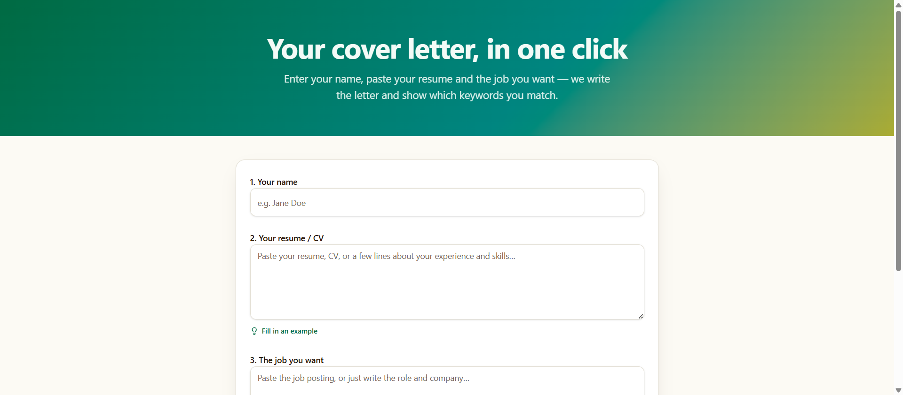

<p align="center">
  
</p>

<h1 align="center">📝 Tailored Hire AI</h1>

<p align="center">
  A tailored cover letter, keyword match score, and resume tips from one paste.
  <br/>
  <a href="https://tailored-hire-ai-main.vercel.app"><strong>Live demo →</strong></a>
</p>

<p align="center">
  
  
  
  
  
</p>

## The problem this solves

Recruiters spend seconds on a cover letter, and ATS software silently filters applications that don't mirror the job posting's language. Most candidates send the same generic letter to every job — a fatal mistake. Tailored Hire AI turns a resume + job posting into a genuinely tailored letter that references real details from your background, tells you exactly which keywords you match and which you're missing, and ranks your fit 0–100 before you apply.

## Tech stack

- **Framework:** React 19 + TanStack Start (SSR, server functions) + TanStack Router/Query
- **AI:** Google Gemini with **structured JSON output** (`responseSchema` + `responseMimeType`)
- **Styling:** Tailwind CSS v4 + shadcn/ui
- **Deployment:** Vercel (Nitro preset)
- **Tooling:** TypeScript, ESLint, Prettier, Vite 8

## Key features

- **Tailored cover letter** — 250–350 words built from real resume details, never invented experience
- **Keyword match analysis** — a 0–100 match score with matched vs. missing keyword badges so you know what to add before applying
- **Actionable resume tips** — 3–5 specific improvements per job posting
- **Tone control** — professional, warm, confident, or concise
- **Instant sharing** — copy the finished letter in one click

## How to run locally

```sh
git clone https://github.com/MK-OmniCode/tailored-hire-ai.git
cd tailored-hire-ai
npm install
npm run dev
```

Requires a `GEMINI_API_KEY`:

```sh
# .env.local
GEMINI_API_KEY=your_key_here
```

For production on Vercel, add `GEMINI_API_KEY` to your project's environment variables.

## What I'd improve next

- **Runtime validation of AI output** — the model response is cast to the result type without a Zod parse; a malformed response currently becomes silent empty arrays instead of a friendly error
- **Resume file upload** — parse PDF/DOCX directly instead of requiring a paste
- **Application history** — save past jobs and letters so users can track what they applied to
- **Tests + CI** — the JSON-schema logic is prime unit-test material and currently has zero coverage

---

Built by [Kashif](https://github.com/MK-OmniCode).
